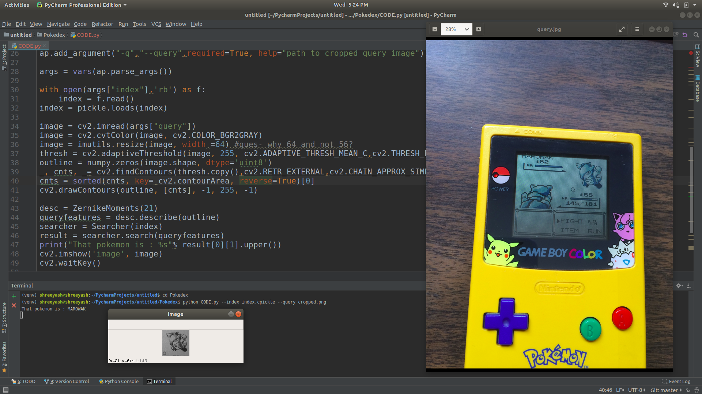

### Pokedex- identify the pokemon

I have given dataset for pokemons, and this program is a simple pokemon search engine which identify the pokemon in given image. first it segments the screen portion of pokedex and then program crops out the image of pokemon(here [MAROWAK](https://bulbapedia.bulbagarden.net/wiki/Marowak_(Pok%C3%A9mon))) in upper right corner. I used ZernikeMoments as my shape descriptors. Euclidean distance has been used as distance matric to find similar pokemon from dataset.Program prints the name of pokemon as output. 
