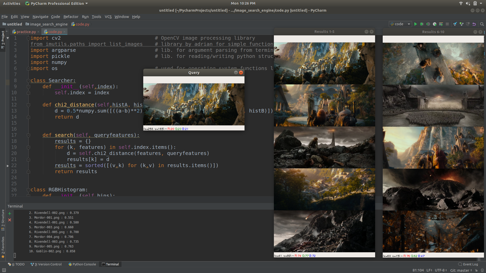

# Image search engine

This image search engine have preloaded dataset on disc.
It uses 3D colour Histograms as image descriptor and then it finds chi-squared distance between histograms to find similarity between images.
Lesser the distance, more similarity in images. I am displaying top 10 similar images from my dataset for a query image.

